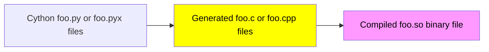
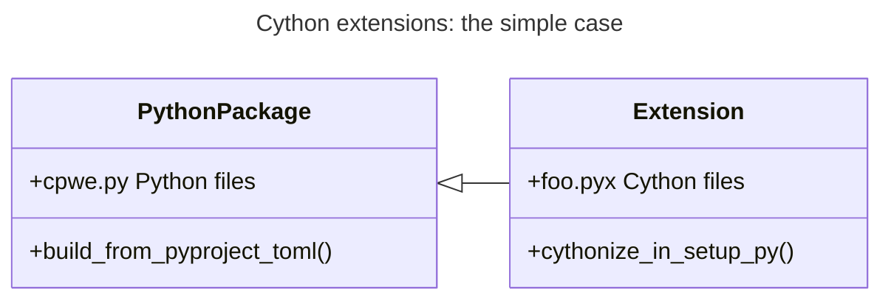
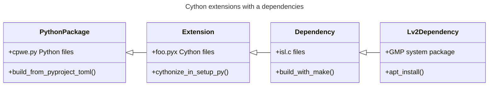

After the last submission of our [Tadashi](/projects/tadashi) paper , one of the reviewers complained about installing Tadashi is similarly cumbersome as installing PET or ISL (which I also struggled with in the beginning and can relate to).
So, to solve this problem, yesterday I spent the whole day hacking and trying to figure out [CIBuildWheel](https://cibuildwheel.pypa.io/en/stable/) and I'm really happy with what I found! **TL;DR: With CIBuildWheel we should be able to upload Tadashi to PyPI and have `pip install tadashi` fully working.**

In the current setup, we can use `pip install git+https://github.com/vatai/tadashi.git`, which, in theory would take care of everything, however, in practice, since it is building PET and ISL in the background, this can go wrong if some dependencies are not installed. CIBuildWheel[^1] solves this problem by building the extensions[^2] in isolation and packaging them into a wheel[^3].

[^1]: CI refers to **Continuous Integration** because CIBuildWheel is primarily used in CI, i.e., to automatically build wheels on, e.g., like GitHub using GitHub actions.
[^2]: **Extensions** are compiled, binary `.so` files which can be `import`ed into python scripts.
[^3]: A **wheel** Python package is a binary distribution (aka **bdist**) package, also containing binary files (such as .pyc/.so/.dll/.dylib files), in contrast to source distribution (aka **sdist**) packages, which contain only source files.

Obviously, **the problem with binary packages is portability**! And I'm not just talking about Linux vs Windows, but also withing Linux, a binary built on one Linux may not work on another Linux. To solve this, CIBuildWheel uses something called [manylinux](https://github.com/pypa/manylinux). As I understand, to the user (package maintainer), manylinux a set of Docker images, with somewhat standard (read older) glibc and other libraries, so that if you compile against those libraries, you cover a lot of systems. Also there are multiple manylinux Docker images, covering different versions of different libraries. CIBuildWheel builds wheels in these Docker containers and by default generates [these](https://github.com/vatai/complicated-project-with-extension/actions/runs/19494788268) Linux wheels (look at the filenames, the `cpXYY` indicates the Python version X-YY, and the rest of the name includes which manylinux was used -- it's a deep rabbit hole and I'll stop here with the explanation). In theory it could generate wheels for Windows and Mac too :shrug:.

# Prototyping

Before going "all in" to apply this to Tadashi, I made a PoC repo (called [Complicated project with extensions](https://github.com/vatai/complicated-project-with-extension), or `cpwe` for short) to test the critical parts (i.e., parts I didn't quite understand) of this setup. This also included Cython integration, the new approach I plan to implement to interface the PET/ISL libraries with Python (instead of SWIG, which I currently use). Cython is not just a more "pythonic" approach, it also simplifies many things both in Tadashi's code and in the build process.

## The goals

I originally intended cover (a simplified version of) everything including uploading binary packages to PyPI, and test `pip install cpwe`, but then I realised I can do things locally: When I saw all the wheels (`.whl` files) created by CIBuildWheel, I realised PyPI most likely just stores these `.whl` files and `pip install cpwe` probably just selects the appropriate `.whl` file, downloads it, and installs it, which can also simulated locally with `pip install the_appropriate_wheel.whl`!

One goal was to **set up GitHub actions to generate all the wheels automatically**. This was easy to achieve following the [CIBuildWheel docs](https://cibuildwheel.pypa.io/en/stable/ci-services/) and also easy to verify, bacause the example in the docs uploaded all the wheels as [artifacts](https://github.com/vatai/complicated-project-with-extension/actions/runs/19494788268). These wheels would then be uploaded via GH actions (using twine) to PyPI, something I already implemented in [another project](/projects/radicalpy).

The other, more important, goal was **making a wheel which includes binaries from a separate C library**, i.e. has Python code which calls functions from a C library (i.e., ISL). I should elaborate.

## Getting the right wheels

To summarise, we want to

- build a Python extension,
- using Cython,
- which would be calling a third party C library (namely ISL).

### Extensions: The simple case

Most of the docs describe Cython extensions (or SWIG extensions for that matter) as standalone code, that are converted into C/C++ code and then built into an `.so` file. It looks something like this:



And that final `foo.so` file has all the code you need! So the dependencies are simple:



### Extensions with dependencies

However our situation is more complicated: Our `foo.so` has an extra dependency (ISL), which itself pulls in other dependencies (namely GMP) which are not necessary installed on the end-user's system.



And this is why CIBuildWheel is _DA BOOOOMB_! It takes care of all this!

These are the relevant parts of the `pyproject.toml` file that configures the whole project:

<!-- prettier-ignore-start -->

[build-system]
requires = ["setuptools", "cython", "cibuildwheel"]
build-backend = "setuptools.build_meta"

[tool.cibuildwheel]
build-frontend="build[uv]"
before-all = ["./third_party/install.sh"]
# build = "cp313-manylinux_x86_64"
# manylinux-x86_64-image = "manylinux-mod"

<!-- prettier-ignore-end -->

In line 2 we list `cibuildwheel` as a build dependency (it can just be `pip install`ed as any other Python package).

The block from line 5 covers the `cibuildwheel` specific settings. Setting the frontend to use `uv` potentially speeds up the build process. And finally **the `before-all` allows us to call a script which builds our dependency, i.e. ISL**.

The commented out lines were **hacks to speed up debugging**.

- The `build` field specifies which wheels should be build (uncommenting line 8 would produce only the wheel built agains Python 3.13 and `manylinux_x86_64`).
- The `manylinux-x86_64-image` field specifies the Docker image to be used for `manylinux-x86_64`. I created a custom Docker image with ISL prebuilt which sped up testing by skipping both downloading the GMP system packages from the Alma Linux repo, and building ISL from source. For this I obviously disabled the `install.sh` script in `before-all`.

## Verification

To verify that everything works as Intended I wrote a small [test script](https://github.com/vatai/complicated-project-with-extension/blob/main/tests/test_local_uv_project_from_scratch.sh). The main steps of the script were the following:

1. Call `uvx cibuildwheel`, which simulates what happens in the GH action and builds the `.whl` files locally.
2. Create a temporary Python project, with `uv`.
3. Installing the `cpwe` package, i.e., newly generated`.whl` file in the project's `venv`.
4. Running code which invokes `cpwe` so it calls ISL functions.

`uv` is used out of convenience to automate the process of creating a `venv`, activating the `venv`, installing a wheel to the `venv`, running a python script in the `venv` and disabling the `venv`. Both the directories where wheels are created (step 1) and the directory where the `uv` project is created (step 2) are delete and regenerated from scratch every time the script executes.

## Additional verification

I used the process described above as a quick indicator whether things are working or not. To simulate installing and running the code in the package on a random computer, i.e., to double check that CIBuildWheel actually builds a wheel that has all the code required to be executed on any system (without any dependency outside of the Python ecosystem), I spun up an clean Ubuntu container, I copied the appropriate `.whl` file to it, installed `uv` and some other Python packages, and executed a similar script as above. This confirmed that it worked on any system, even if it didn't have GMP or ISL installed.

I looked inside the `venv` after installing the wheel to see how this is achieved. Inside the `site-packages` I found the following files:

```
.
├── cpwe
│   ├── foo.c # C code (generated by Cython)
│   ├── foo.cpython-313-x86_64-linux-gnu.so #!!! .so file (built from the C code)
│   ├── foo.py # source containing Cython code (written by me)
│   └── isl.pxd # Cython "header" file to declaring the ISL functions (written by me)
...
├── cpwe.libs
│   ├── libgmp-d944b113.so.10.3.2  manylinux container #!!! .so copied from the system package within the
│   └── libisl-8ba7b133.so.23.4.0 #!!! .so file built in the container


```

CIBuildWheel added all the relevant `.so` files: the `foo.cython*.so` generated from my Cython code in `foo.py` (which would be the only file if this were the simple case) and the `libisl*.so*` which was Cython extension's dependency, and `libgmp*.so*` which was `libisl*.so*`'s dependency. :tada::tada::tada:

## Future work

For now, this really was a minimal working example for building portable wheel packages, and only included ISL as a dependency. I need to see if this works also for PET which includes LLVM as a dependency -- which is _slightly_ larger than GMP. :cold_sweat:

In a separate attempt (which I didn't publish in a repo or blog post), I managed to write a Cython function which was used as the callback parameter in the C function which is PET's entry point. This callback mechanism was one of the main reasons I wrote most of Tadashi in C, I imagined it would be hard to interface Python code with ISL's callback setup. Figuring out how to create callbacks in Cython I can more freely mix Python and C code, which would enable a sane way to organise code such that it includes both the current PET and future (Fortran enabled) LLVM/Polly backend.
