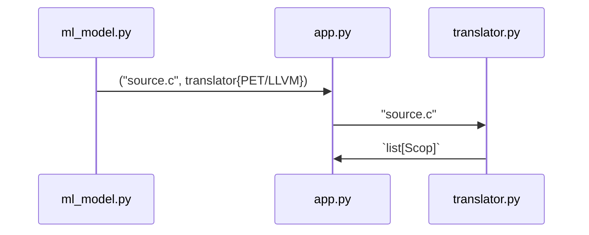

<!-- ```mermaid -->
<!-- sequenceDiagram -->
<!--   ml_model.py->>PETApp: source -->
<!--   PETApp->>BaseApp: puplate_scops() -->

<!--   ml_model.py->>Ctadashi: transform() -->
<!--   Ctadashi->>BaseApp: new state -->

<!--   ml_model.py->>Ctadashi: transform() -->
<!--   Ctadashi->>BaseApp: new state -->

<!--   ml_model.py-\->>BaseApp: reset() -->
<!--   BaseApp-\->>BaseApp: restore state -->

<!--   ml_model.py->>PETApp: generate_code() -->
<!--   BaseApp-)PETApp: scops[] -->
<!--   PETApp->>tapp: new_source.c generate_code() -->
<!-- ``` -->

This post is basically me [rubber-ducking](https://blog.codinghorror.com/rubber-duck-problem-solving/) how I should refactor
[Tadashi](/projects/tadashi)  to include LLVM/Polly backend (which would enable fortran support). I'll try to list the
requirements focusing on the Python-C/C++ interface.

We need a _Python_ interface to specify the C input program and the backend, and it should return a _Python_ object which we'll use for:

- querying transformations
- executing transformations
- generating transformed code

```python
app = App("source.c", backendPET)
# list[scop] = backendPET("sources.")
# pet: run transform fn (in C)
# llvm: run clang (both) and collect schedule (in C)
```

```python
node = app.scops[i].schedule_tree[j]
# locate node (in C, in scop)

legal = node.transform(tr, *args)
# transform, (in C, in scop)

tapp = app.gencode()
# pet: run again transofm(list[pet_scop*])
# llvm: write scop->json and run clang

tapp.measure()
# 100% in pyhon
```



  <!-- M->>Ctadashi: transform() -->
  <!-- Ctadashi->>BaseApp: new state -->

  <!-- M->>Ctadashi: transform() -->
  <!-- Ctadashi->>BaseApp: new state -->

  <!-- M-\->>BaseApp: reset() -->
  <!-- BaseApp-\->>BaseApp: restore state -->

  <!-- M->>PETApp: generate_code() -->
  <!-- BaseApp-)PETApp: scops[] -->
  <!-- PETApp->>tapp: new_source.c generate_code() -->
