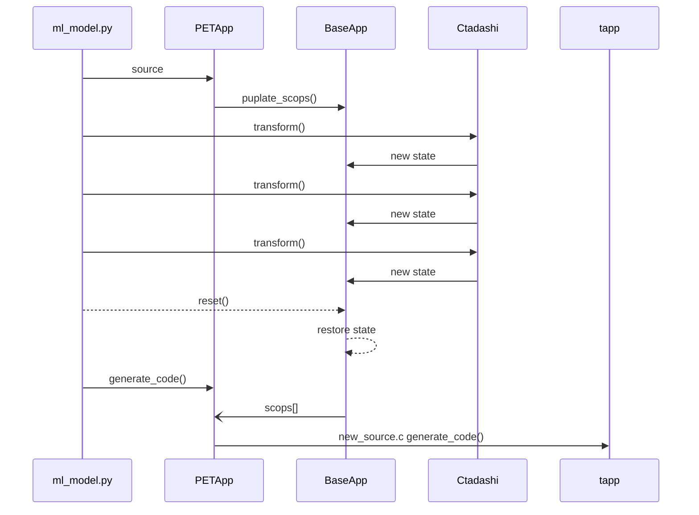

```mermaid
sequenceDiagram
  ml_model.py->>PETApp: source
  PETApp->>BaseApp: puplate_scops()
  ml_model.py->>Ctadashi: transform()
  Ctadashi->>BaseApp: new state
  ml_model.py->>Ctadashi: transform()
  Ctadashi->>BaseApp: new state
  ml_model.py->>Ctadashi: transform()
  Ctadashi->>BaseApp: new state
  ml_model.py-->>BaseApp: reset()
  BaseApp-->>BaseApp: restore state
  ml_model.py->>PETApp: generate_code()
  BaseApp-)PETApp: scops[]
  PETApp->>tapp: new_source.c generate_code()
```
